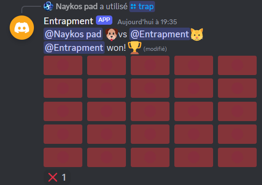

# ⌨️ Discord game bot

Discord bot allowing you to play games against your friends in your Discord server! (Or against the bot if you do not have any)

  

The bot is implemented in C++ using [D++](https://dpp.dev/). 

The games are saved in a JSON backup. The games are restored after each restart.

This project was done in the context of the [INFO0004 course](https://www.programmes.uliege.be/cocoon/20232024/cours/INFO0004-2.html).

Note : No copying (even partial) of this code within the scope of the INFO0004 course will be tolerated.

## Summary
1. [Try it!](#try-it)
2. [Troubleshooting](#troubleshooting)
3. [Entrapment - Game rules](#entrapment---game-rules)
4. [Entrapement - Interactions](#entrapement---interactions)
5. [Credits](#credits)

## Try it!
1. Follow the [tutorial on the D++ page](https://dpp.dev/creating-a-bot-application.html) to create a new bot and generate a bot token. When you create the bot you can leave its permissions to 0.

2. Invite the bot on your Discord server and assign it a role with "Administrator" permissions.

3. Run the `make` command in your terminal, then run `./entrapment botToken` where botToken is the token created at step 1.

4. Summon a new game with the command `/trap @playerMention`.

## Troubleshooting

If your bot prints an error like this in the terminal : `[2024-06-03 08:21:12] ERROR: Error: 50001: Missing Access`, be sure you have checked the `applications.commands` and `bot` scope in the OAuth2 URL Generator :

  

## Entrapment - Game rules
Entrapment is a channel game played in 1vs1 (against player or a bot).

The game is played on a grid, empty at the start. When a player move he leaves a mine at his previous position.

The goal of each player is to trap the other. A player is trapped if he can not move anymore, i.e. if he is surrounded by mines/the other player.

## Entrapement - Interactions
- A player can start a game using the command `/trap playerName` where playerName is the name of a player or your bot

  

- A player can play a move by clicking a red cell when it is its turn.

  

- A player can surrend by reacting to the game message with the emoji ❌ (i.e :x: ) :

  

- If a player tries to play when it is not its turn, he receives a message from the bot :

  

- If someone interacts with a game he is not part of, he receives a message from the bot :

  

- If someone interacts with an unknown game (happens if the backups are deleted), he receives a message from the bot :

  

## Credits
- [Simon Gardier](https://github.com/simon-gardier) (Co-author)
- Camille Trinh

